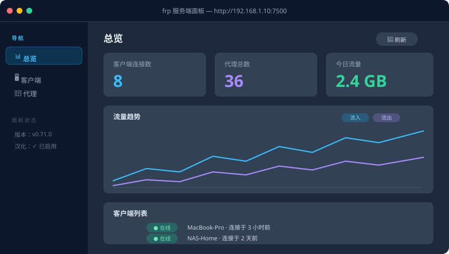
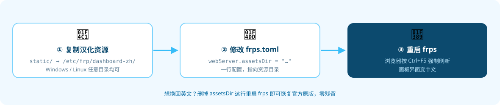

<div align="center">


# frps-dashboard-zh

**frp v0.71.0 官方服务端面板完整中文汉化静态资源**


</div>

---

官方面板界面是**硬编码英文**的，没有语言切换选项。本仓库提供已经汉化好的面板文件，通过 frps 自带的 `webServer.assetsDir` 配置即可直接使用，**无需替换 frps 二进制、无需 Docker**。

## 🖥️ 汉化效果

<div align="center">

</div>

- **侧边栏**：总览 / 客户端 / 代理
- **状态徽标**：在线 / 离线 / 已连接 / 已断开 / 已启用 / 已禁用
- **按钮**：刷新 / 清理离线 / 确认 / 取消
- **配置项**：加密、压缩、自定义域名、子域名、主机重写、多路复用器……
- **统计与图表**：连接数、流量、今日流量、流入 / 流出图例
- **相对时间**：X 年前 / 个月前 / 天前 / 小时前 / 分钟前 / 秒前
- **Element Plus 组件文案**（分页器、空数据、下拉、弹窗按钮等）全部中文化

## 🚀 三步安装

<div align="center">

</div>

### 1. 复制汉化资源

把 `static/` 目录整个复制到 frps 所在机器，例如 `/etc/frp/dashboard-zh/`（Windows 下任意目录均可）。

### 2. 修改配置

在 `frps.toml` 中添加：

```toml
webServer.port = 7500
webServer.assetsDir = "/etc/frp/dashboard-zh"
```

### 3. 重启生效

重启 frps，浏览器按 **Ctrl+F5 强制刷新**面板页面即可。

> 💡 不想要汉化了？删掉 `assetsDir` 这行重启 frps 就恢复官方原版，零残留。

## 📂 文件说明

| 文件 | 说明 |
|---|---|
| `static/index.html` | 面板入口页（已改标题为「frp 服务端面板」） |
| `static/index-BTokoqTQ.js` | 汉化后的主程序（对应 frp v0.71.0 官方构建） |
| `static/index-60N7C6S6.css` | 样式表（未修改） |
| `hanlify_patch.py` | 通用汉化补丁脚本：`python hanlify_patch.py <面板目录>`，对从面板下载的官方 JS 应用全部人工补充替换规则 |
| `使用说明.txt` | 简明安装说明（也包含在 Release 压缩包里） |

## ⚠️ 注意事项

- **版本对应**：本资源基于 frp **v0.71.0** 的官方面板制作。frp 升级后面板文件名里的哈希会变化，需要重新提取并打补丁
- **提取方法**：从 `http://<frps>:7500/static/` 下载 `index.html` 及其引用的 JS/CSS 到 assetsDir 目录，再按需替换字符串
- **汉化方式**：基于 [Firfr/frp_zh](https://github.com/Firfr/frp_zh) 项目的翻译映射（118 条）+ 人工补充约 50 条（状态徽标、按钮、分页、弹窗、相对时间、API 状态值渲染映射等），**仅替换字符串字面量，不改动任何逻辑代码**

## ❓ 常见问题

**刷新后还是英文？** 浏览器缓存了旧文件，按 `Ctrl+F5` 强制刷新即可。

**frp 升级后面板变回英文 / 打不开了？** 本汉化包只对应 frp v0.71.0。frp 升级后请到本仓库看有没有新版，或用 `hanlify_patch.py` 重新生成。

**安全吗？** 汉化只替换了界面显示的文字（字符串），没有改动任何功能逻辑，也不会联网上传任何数据。

## 🙏 致谢

- [fatedier/frp](https://github.com/fatedier/frp) — 原项目
- [Firfr/frp_zh](https://github.com/Firfr/frp_zh) — 翻译映射表来源

## 📄 开源协议

面板资源版权归 frp 原项目所有（Apache License 2.0），本仓库的汉化补丁部分同样以 [Apache License 2.0](LICENSE) 发布。

<div align="center">

**如果这个汉化包对你有帮助，欢迎点一个 ⭐ Star 支持一下！**

</div>
